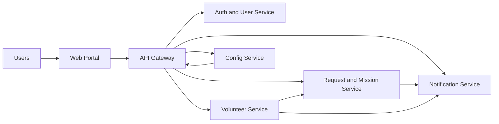

# Disaster Management Platform

## 1. Project Summary

This platform supports disaster-response coordination with one shared web portal and backend microservices.

Main goals:
- let affected people quickly send a **Need Help** request
- show rescue progress with a **Sri Lanka mission map** and live mission status
- let volunteers register and get verified before activation
- allow admins to coordinate assignments and updates
- send notifications for every important event

## 2. User Roles

- **Requester (Citizen):** Creates rescue/help missions and tracks status.
- **Volunteer:** Registers skills and availability, receives assignments after approval.
- **Admin/Coordinator:** Manages requests, resources, and mission assignments.
- **Super Admin:** Verifies volunteer legitimacy and approves/rejects volunteer activation.

## 3. Core Functional Modules

### 3.1 Loading + Mission Map
- Landing/loading screen shows a Sri Lankan map.
- District or city points display active missions.
- Mission status indicators (example): `pending`, `assigned`, `ongoing`, `completed`.
- Route/response visualization can be shown from rescue base to target location.

### 3.2 Rescue Mission Management
- Users submit **Need Help** requests with location, urgency, and description.
- Admin team reviews and creates/updates missions.
- Mission lifecycle is tracked end to end.

### 3.3 Volunteer Registration and Approval
- Volunteers register through the public registration flow.
- Volunteer profile stays in `pending approval` until reviewed.
- Super Admin validates details and either approves or rejects the profile.
- Only approved volunteers can be assigned to live rescue missions.

### 3.4 Notification Center
- Sends in-app updates for:
  - request received
  - volunteer approved/rejected
  - mission assigned
  - status changed to ongoing/completed
- Notification history is visible to users.

## 4. Service Architecture



## 5. Service Responsibilities

- **Web Portal (`apps/web`)**
  - Loading screen, map view, login/register, dashboard, mission, volunteer, admin pages.
- **API Gateway (`services/api-gateway`)**
  - Single API entry point and route forwarding.
- **Config Service (`services/config-service`)**
  - Central runtime configuration for public and internal service URLs.
- **Auth Service (`services/auth-service`)**
  - Registration, login, identity, role management.
- **Request Service (`services/request-service`)**
  - Mission/request creation, filtering, status updates.
- **Volunteer Service (`services/volunteer-service`)**
  - Volunteer profiles, availability, resources, assignments.
- **Notification Service (`services/notification-service`)**
  - Notification logs and mission status timeline events.

## 6. Core API Contract (High-Level)

- **Gateway health:** `GET /health`
- **Gateway proxy root:** `ALL /api/*`

- **Auth**
  - `POST /api/v1/auth/register`
  - `POST /api/v1/auth/login`
  - `GET /api/v1/auth/me`
  - `PATCH /api/v1/users/:id/role`

- **Requests/Missions**
  - `POST /api/v1/requests`
  - `GET /api/v1/requests`
  - `PATCH /api/v1/requests/:id/status`

- **Volunteers/Assignments**
  - `POST /api/v1/volunteers`
  - `GET /api/v1/volunteers`
  - `POST /api/v1/assignments`
  - `GET /api/v1/assignments/:requestId`

- **Notifications**
  - `POST /api/v1/notifications`
  - `GET /api/v1/notifications/user/:userId`
  - `POST /api/v1/status-events`
  - `GET /api/v1/status-events/request/:requestId`

- **Configuration**
  - `GET /api/v1/config/public`
  - `GET /api/v1/config/internal`

## 7. Suggested Status Standards

- **Mission status:** `pending`, `matched`, `assigned`, `in_progress`, `completed`, `cancelled`
- **Volunteer status:** `pending_approval`, `approved`, `rejected`, `available`, `busy`, `offline`
- **Assignment status:** `assigned`, `in_progress`, `completed`

## 8. Runtime Configuration (Example)

Use environment variables for routing and service discovery:
- `API_GATEWAY_URL`
- `CONFIG_SERVICE_URL`
- `AUTH_SERVICE_URL`
- `REQUEST_SERVICE_URL`
- `VOLUNTEER_SERVICE_URL`
- `NOTIFICATION_SERVICE_URL`
- `NEXT_PUBLIC_API_BASE_URL`
- `JWT_SECRET`

## 9. Local Run (Current Monorepo)

```bash
cp .env.example .env
pnpm install
pnpm dev
```

Default local ports:
- Web: `3000`
- Auth: `3001`
- Request: `3002`
- Volunteer: `3003`
- Notification: `3004`
- API Gateway: `3005`
- Config Service: `3006`

## 10. Smoke Tests

After starting services (`pnpm dev`), run:

```bash
pnpm test:api-smoke
pnpm test:ui-smoke
```
