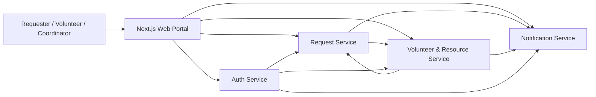
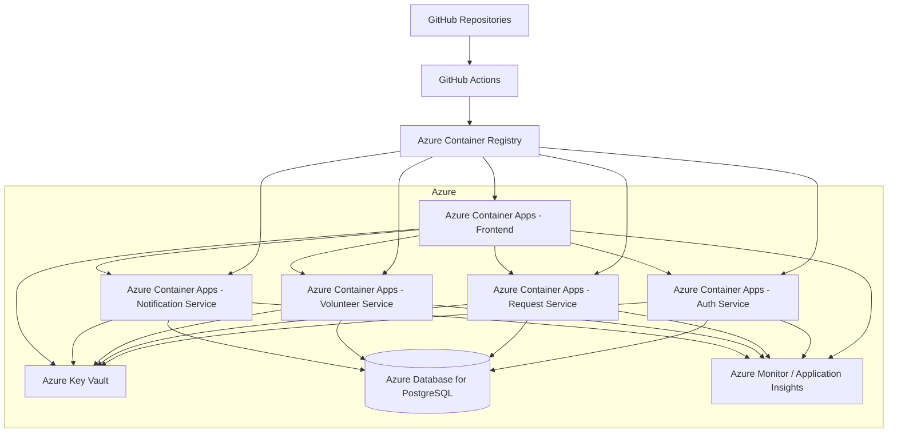
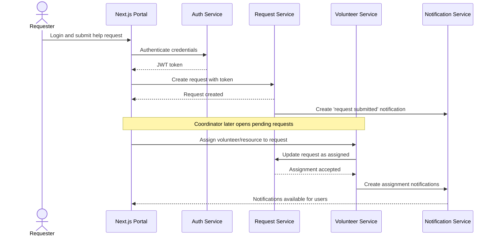
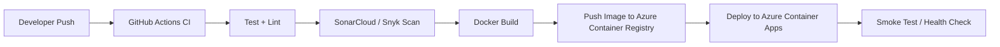
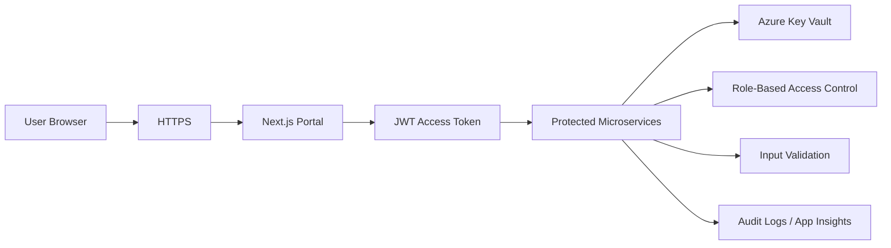

# ReliefLink Project Guide
## Disaster Relief Request Coordination System
### TypeScript + Next.js + Azure Microservices Architecture

---

## 1. Document Purpose

This document converts the assignment brief into a **project-specific implementation guide** for a **Disaster Relief Request Coordination System** built with **TypeScript**, **Next.js**, and a **microservice architecture**.

It is designed to help the team:
- choose a safe, high-scoring architecture
- keep the system aligned with the assignment
- use **4 independently deployable microservices**
- deploy on a **Microsoft Azure-friendly cloud architecture**
- show **CI/CD, Docker, security, DevSecOps, and service-to-service communication**
- prepare a clean report and a 10-minute demo

---

## 2. Assignment Fit

This project fits the brief well because the assignment requires:
- **one cohesive application with 4 microservices**
- **independent deployment** of each microservice
- **public cloud deployment**
- **real inter-service communication**
- **Docker-based containerization**
- **CI/CD automation**
- **basic security measures**
- **managed SAST / DevSecOps tooling**
- **a shared architecture diagram**
- **a live demo of at least one integration point**

ReliefLink is a strong choice because it naturally creates a clear workflow:
1. a user submits a help request
2. the system stores and prioritizes it
3. a volunteer/resource is matched and assigned
4. both sides receive notifications and status updates

That workflow is easy to explain, realistic to build, and easy to demonstrate live.

---

## 3. Final Recommended Architecture Decision

### Important design decision
Use:
- **Next.js** for the **shared web portal / dashboard / admin UI**
- **TypeScript backend microservices** for the actual 4 graded services

### Why this matters
Next.js is excellent for:
- web UI
- server-rendered frontend
- dashboard pages
- route handlers / API proxying
- lightweight backend-for-frontend behavior

But for the assignment, the **4 core graded components should still be independent backend microservices**, not just pages inside one single Next.js app.

### Best architecture choice
- **Frontend:** Next.js App Router (TypeScript)
- **Backend microservices:** TypeScript services using **NestJS**
- **Databases:** PostgreSQL
- **Containerization:** Docker
- **Cloud:** Azure Container Apps
- **Image registry:** Azure Container Registry
- **Secrets:** Azure Key Vault
- **Observability:** Azure Monitor + Application Insights
- **CI/CD:** GitHub Actions
- **DevSecOps:** SonarCloud or Snyk

---

## 4. High-Level Solution Overview

**System name:** ReliefLink

**Business goal:**
Allow affected people to create disaster-relief requests, allow volunteers or coordinators to view and assign resources, and notify participants as the request moves through its lifecycle.

### Main users
- affected citizen / requester
- volunteer
- coordinator / admin

### Core user story
> A requester logs in, submits a high-priority relief request for water and medicine, a coordinator assigns a nearby volunteer or available resource, and the system updates the request state and notifies the involved users.

---

## 5. Recommended Service Breakdown

The 4 graded microservices should be:

1. **Auth Service**
2. **Request Service**
3. **Volunteer & Resource Service**
4. **Notification Service**

The **Next.js frontend is not counted as one of the 4 microservices**. It is the shared client application used to interact with the services.

---

## 6. System Context Diagram



### Reading this diagram
- Users access the system through the **Next.js web portal**.
- The portal communicates with backend services through HTTP APIs.
- The backend services also communicate with each other.
- Every service has at least one real integration point.

---

## 7. Shared Azure Deployment Architecture



### Azure resource plan
- **Azure Container Apps** hosts the frontend and each backend microservice as separate containers.
- **Azure Container Registry** stores Docker images.
- **Azure Key Vault** stores secrets such as JWT keys, database URLs, and API keys.
- **Azure Database for PostgreSQL** stores relational data.
- **Application Insights / Azure Monitor** captures logs, telemetry, and failures.

---

## 8. Why Azure Container Apps is a Good Fit

This architecture is especially strong on Azure because Azure Container Apps is designed for containerized applications and microservices, Azure Container Registry provides managed image storage, Azure Key Vault provides secret storage, Azure Database for PostgreSQL provides managed PostgreSQL hosting, and Azure Monitor / Application Insights provides application telemetry and monitoring.

---

## 9. TypeScript + Next.js Technology Stack

### Frontend
- **Next.js (App Router)**
- **TypeScript**
- Tailwind CSS
- optional component library: shadcn/ui
- data fetching via server actions or client fetch calls

### Backend microservices
- **NestJS + TypeScript**
- REST APIs
- Swagger / OpenAPI
- Zod or class-validator for input validation
- Prisma ORM or Drizzle ORM

### Database
- PostgreSQL

### Quality and testing
- Jest / Vitest
- Supertest for API tests
- ESLint
- Prettier
- Husky + lint-staged (optional)

### DevOps / cloud
- Docker
- GitHub Actions
- Azure Container Registry
- Azure Container Apps
- Azure Key Vault
- Azure Monitor / Application Insights
- SonarCloud or Snyk

---

## 10. Why Next.js Should Be the Frontend, Not the Only Backend

Next.js supports Route Handlers and self-hosted Docker deployments, which makes it useful for frontend and lightweight server-side logic. However, for this assignment the cleanest design is still to keep the 4 core business services as separate deployable backend services, while Next.js acts as the portal.

### Recommended rule
- Use **Next.js** for UI and thin API proxy/BFF behavior if needed.
- Use **NestJS services** for the 4 actual graded backend microservices.

This gives you:
- better service boundaries
- easier Docker deployment per service
- cleaner Swagger docs per service
- simpler CI/CD pipelines
- clearer viva explanation

---

## 11. Microservice Responsibilities

## 11.1 Auth Service

### Purpose
Handle registration, login, identity, and authorization.

### Responsibilities
- register users
- login users
- hash passwords securely
- issue JWT access tokens
- support roles
- expose current user profile

### Roles
- `requester`
- `volunteer`
- `coordinator`
- `admin` (optional)

### Example endpoints
- `POST /api/v1/auth/register`
- `POST /api/v1/auth/login`
- `GET /api/v1/auth/me`
- `GET /api/v1/users/:id`
- `PATCH /api/v1/users/:id/role`
- `GET /health`

### Example data model
```text
User
- id
- fullName
- email
- phone
- passwordHash
- role
- district
- city
- createdAt
- updatedAt
```

### Main integrations
- Request Service trusts JWT tokens from Auth Service
- Volunteer Service validates user role and identity
- Notification Service may use user profile info when creating notifications

---

## 11.2 Request Service

### Purpose
Manage disaster relief requests and their lifecycle.

### Responsibilities
- create new requests
- view request details
- update request information
- manage request status
- filter requests by district, category, urgency, and status
- expose pending requests for assignment

### Suggested request categories
- water
- food
- medicine
- shelter
- rescue
- transport
- other

### Suggested statuses
- `pending`
- `matched`
- `assigned`
- `in_progress`
- `completed`
- `cancelled`

### Example endpoints
- `POST /api/v1/requests`
- `GET /api/v1/requests`
- `GET /api/v1/requests/:id`
- `PATCH /api/v1/requests/:id`
- `PATCH /api/v1/requests/:id/status`
- `GET /api/v1/requests?status=pending`
- `GET /api/v1/requests?urgency=high&district=Gampaha`
- `GET /health`

### Example data model
```text
ReliefRequest
- id
- requesterId
- category
- description
- urgency
- district
- city
- peopleCount
- status
- createdAt
- updatedAt
```

### Main integrations
- reads user identity from Auth Service token
- is queried by Volunteer Service / Coordinator workflow
- calls Notification Service when request state changes

---

## 11.3 Volunteer & Resource Service

### Purpose
Manage volunteer availability, resource records, and request assignments.

### Responsibilities
- register volunteers
- manage volunteer availability
- register available resources
- search available volunteers/resources by district and category
- assign volunteers/resources to requests

### Keep the scope realistic
Use:
- district
- city
- category
- availability

Do **not** attempt:
- live GPS tracking
- route optimization
- real-time maps

### Example endpoints
- `POST /api/v1/volunteers`
- `GET /api/v1/volunteers`
- `PATCH /api/v1/volunteers/:id/availability`
- `POST /api/v1/resources`
- `GET /api/v1/resources`
- `GET /api/v1/resources?district=Colombo&category=water`
- `POST /api/v1/assignments`
- `GET /api/v1/assignments/:requestId`
- `GET /health`

### Example data models
```text
Volunteer
- id
- userId
- skillSet
- district
- city
- availabilityStatus
- createdAt
- updatedAt

Resource
- id
- ownerId
- category
- quantity
- district
- city
- availabilityStatus
- createdAt
- updatedAt

Assignment
- id
- requestId
- volunteerId
- resourceId
- assignedBy
- status
- assignedAt
```

### Main integrations
- validates role and identity via Auth Service
- reads open requests from Request Service
- updates Request Service when assignment happens
- triggers Notification Service after assignment

---

## 11.4 Notification Service

### Purpose
Provide notification logging and request activity tracking.

### Responsibilities
- create notification records
- list notifications for a user
- store status change history
- optionally send email notifications later

### MVP approach
For the student version, treat this as:
- **notification log service first**
- **real email sending second** (optional)

### Example endpoints
- `POST /api/v1/notifications`
- `GET /api/v1/notifications/user/:userId`
- `POST /api/v1/status-events`
- `GET /api/v1/status-events/request/:requestId`
- `GET /health`

### Example data models
```text
Notification
- id
- userId
- message
- channel
- deliveryStatus
- createdAt

StatusEvent
- id
- requestId
- oldStatus
- newStatus
- changedBy
- timestamp
```

### Main integrations
- Request Service creates status change notifications
- Volunteer Service creates assignment notifications
- Next.js frontend queries this service to show user alerts

---

## 12. Service Interaction Matrix

| From Service | To Service | Reason |
|---|---|---|
| Next.js Portal | Auth Service | login, session, role-aware UI |
| Next.js Portal | Request Service | create and manage requests |
| Next.js Portal | Volunteer Service | manage volunteers, resources, assignments |
| Next.js Portal | Notification Service | show notifications and status history |
| Request Service | Notification Service | notify on create / update / status change |
| Volunteer Service | Request Service | fetch or update assignable requests |
| Volunteer Service | Notification Service | notify when assignment occurs |
| Auth Service | Other services | JWT validation / trusted identity flow |

---

## 13. Main End-to-End Workflow



### Demo value
This single workflow proves:
- authentication
- request creation
- inter-service communication
- state transition
- notification generation
- a meaningful business process

---

## 14. Recommended Data Ownership Strategy

### Best practice
Each microservice should own its own tables and business logic.

### Student-friendly implementation
Use one managed PostgreSQL server with **separate databases or schemas per service** if needed for cost and simplicity.

### Suggested logical separation
- `auth_db`
- `request_db`
- `volunteer_db`
- `notification_db`

### Rule
Do not let one service directly modify another service's tables.
All cross-service interactions should happen through APIs.

---

## 15. Frontend Architecture with Next.js

### Recommended pages
- `/login`
- `/register`
- `/dashboard`
- `/requests`
- `/requests/new`
- `/volunteers`
- `/resources`
- `/assignments`
- `/notifications`
- `/admin`

### Recommended layout
- server-rendered shell with role-aware navigation
- client components only where needed
- shared API client per service
- environment-driven base URLs for services

### Suggested frontend modules
```text
apps/web
- app/
  - login/
  - dashboard/
  - requests/
  - volunteers/
  - notifications/
- components/
- lib/
  - api/
  - auth/
  - validation/
- middleware.ts
```

### Authentication pattern
- login via Auth Service
- store access token in secure cookie or controlled session strategy
- pass token to backend services from frontend server actions or API client

---

## 16. Recommended Repo Strategy

### Best submission-safe approach
Use **separate repositories for each graded microservice**, plus one shared architecture/report repo and optionally one frontend repo.

### Suggested repositories
- `relieflink-auth-service`
- `relieflink-request-service`
- `relieflink-volunteer-service`
- `relieflink-notification-service`
- `relieflink-web-portal`
- `relieflink-docs` (optional)

### Why this is safer
The brief asks for a public repository for each microservice. Separate repositories make individual ownership and pipeline evidence easier to show.

---

## 17. Suggested Backend Project Structure

```text
src/
- main.ts
- app.module.ts
- config/
- common/
  - guards/
  - interceptors/
  - filters/
  - dto/
- modules/
  - auth/
  - requests/
  - volunteers/
  - resources/
  - assignments/
  - notifications/
- prisma/
- health/
- docs/
```

For each service, trim the modules to fit that service only.

---

## 18. API Documentation Requirement

Each backend service should expose:
- Swagger UI endpoint
- OpenAPI JSON document
- health endpoint

### Minimum required docs
- endpoint list
- request body schema
- response examples
- auth requirements
- common error responses

### Good standard
- Swagger path: `/api-docs`
- Health path: `/health`

---

## 19. CI/CD Architecture



### Pipeline stages
1. install dependencies
2. run lint
3. run unit tests
4. run API tests if available
5. run SonarCloud or Snyk scan
6. build Docker image
7. push image to ACR
8. deploy updated revision to Azure Container Apps
9. run smoke test against `/health`

### Per-service CI/CD
Each service should have its **own pipeline**.
That makes the “independent deployability” story much stronger.

---

## 20. Docker Strategy

### Each microservice should have
- `Dockerfile`
- `.dockerignore`
- production environment variables
- health endpoint used after deploy

### Basic production image pattern
- build stage
- runtime stage
- install production dependencies only
- expose app port
- run service with production command

### Suggested conventions
- Auth Service: port `3001`
- Request Service: port `3002`
- Volunteer Service: port `3003`
- Notification Service: port `3004`
- Next.js Portal: port `3000`

---

## 21. Security Architecture



### Minimum security measures
- JWT authentication
- role-based authorization
- password hashing with bcrypt or argon2
- secure secret storage
- validation on all incoming DTOs
- sanitized error responses
- CORS policy
- rate limiting on auth endpoints
- HTTPS-only deployment
- least-privilege cloud identities

### Azure-specific security controls
- use Key Vault for secrets
- limit service permissions by identity / RBAC
- avoid hardcoding secrets in GitHub or source code
- keep connection strings out of repos

### Assignment-visible security points
These are the items you should be ready to explain in the viva:
- where secrets are stored
- how JWT is signed and verified
- who can access which endpoint
- how you protect admin/coordinator actions
- what SAST tool you integrated
- how deployment credentials are stored safely

---

## 22. Recommended Auth and Authorization Rules

| Role | Allowed Actions |
|---|---|
| requester | register, login, create own requests, view own requests, view own notifications |
| volunteer | update own profile, set availability, view assigned tasks, view notifications |
| coordinator | list all requests, assign resources, update request status, view operational data |
| admin | optional full access |

### Rule examples
- only a requester can create a new request for themselves
- only coordinator/admin can create assignments
- only assigned volunteers can update certain execution statuses
- only authenticated users can read personal notifications

---

## 23. Validation Rules

### Request Service
- category must be from allowed enum
- urgency must be `low`, `medium`, or `high`
- people count must be positive
- district and city cannot be empty

### Auth Service
- email must be valid
- password must meet minimum strength rules
- role assignment cannot be arbitrarily elevated by a normal user

### Volunteer Service
- availability status must be enum-based
- quantity must be positive for resources
- assignment must reference an existing open request

---

## 24. Recommended Testing Strategy

### Minimum testing standard per service
- unit tests for business logic
- controller/route tests for main endpoints
- health endpoint test
- at least one integration test or manual proof for service-to-service flow

### Best examples
- Auth: login success / invalid login
- Request: create request / invalid request body
- Volunteer: assignment creation / invalid status
- Notification: notification created when assignment occurs

---

## 25. Required Evidence Checklist

## Functional
- main endpoints work
- happy path is stable
- validation errors are handled cleanly
- health endpoint works

## Integration
- at least one real service-to-service interaction is deployed and demonstrable
- request assignment changes state across services
- notification record proves side effect

## DevOps
- public repo exists
- GitHub Actions workflow exists
- Docker image is pushed to registry
- deployment is automated

## Cloud
- service is live on the internet
- Azure Container Apps is shown in the portal
- deployed URL is reachable

## Security
- secrets are not committed to Git
- JWT and RBAC are implemented
- SAST / DevSecOps tool is integrated
- security explanation is ready for demo

## Documentation
- architecture diagram is included
- endpoints are documented in Swagger
- integration flow is documented
- challenges and resolutions are recorded

---

## 26. Recommended MVP Scope

### Must-have features
- register and login
- create relief request
- list and filter requests
- register volunteer/resource
- assign request
- update request status
- create notification log
- Swagger docs
- Docker deployment
- CI/CD pipeline
- security scan

### Nice-to-have only if time remains
- real email delivery
- analytics dashboard
- map integration
- file/image evidence upload
- admin reporting
- event-driven messaging with a broker

### Strong warning
Do **not** overbuild.
Depth will score better than breadth.

---

## 27. Suggested Team Ownership Split

### Member 1
**Auth Service**
- hardest service
- best for strongest security/backend member

### Member 2
**Request Service**
- central business service
- very strong for demos and report explanation

### Member 3
**Volunteer & Resource Service**
- medium complexity
- important for integration logic

### Member 4
**Notification Service**
- easiest to stabilize
- strong for proving inter-service side effects

### Shared responsibility
**Next.js Portal**
- build together or assign one member as frontend lead
- keep it simple and functional

---

## 28. Suggested Demo Script (10 Minutes)

### Minute 1
Show the architecture diagram and explain the 4 services.

### Minute 2
Show the deployed Next.js portal and login.

### Minute 3
Create a relief request.

### Minute 4
Show the request stored in Request Service.

### Minute 5
Show coordinator assigning a volunteer/resource.

### Minute 6
Show Request Service status changed to `assigned`.

### Minute 7
Show Notification Service log entries for requester and volunteer.

### Minute 8
Show Swagger for one service.

### Minute 9
Show GitHub Actions pipeline and container deployment.

### Minute 10
Explain security: Key Vault, JWT, RBAC, SonarCloud/Snyk.

---

## 29. Common Mistakes to Avoid

### Architecture mistakes
- treating the 4 services as unrelated mini-projects
- counting the frontend as one of the 4 graded microservices
- letting services directly manipulate another service's database

### DevOps mistakes
- manual deployment only
- no Docker registry usage
- one pipeline for everything without service-level proof

### Security mistakes
- secrets in `.env` committed to Git
- no authorization checks
- no scan tool in pipeline

### Demo mistakes
- showing too many unfinished features
- no clear integration proof
- no explanation of cloud resources
- no health checks or public URLs ready

---

## 30. Final Recommendation

### Best final architecture
- **Frontend:** Next.js App Router (TypeScript)
- **4 backend microservices:** NestJS + TypeScript
- **Deployment:** Azure Container Apps
- **Registry:** Azure Container Registry
- **Secrets:** Azure Key Vault
- **Monitoring:** Application Insights
- **Database:** PostgreSQL
- **CI/CD:** GitHub Actions
- **DevSecOps:** SonarCloud or Snyk

### Best technical position to present in viva
> “We used Next.js for the shared web portal and TypeScript microservices for the core backend system. Each microservice is independently containerized, deployed to Azure Container Apps, integrated with at least one other service, documented with Swagger, and protected with JWT, validation, role-based access control, and secret management through Key Vault.”

That statement aligns closely with the assignment and is easy to defend technically.

---

## 31. Suggested Submission Assets

By the end, you should have:
- 4 public service repositories
- 1 frontend repository
- architecture diagram in the report
- Swagger links for each service
- public deployment URLs
- GitHub Actions pipeline screenshots or live runs
- SonarCloud/Snyk evidence
- a rehearsed live integration flow

---

## 32. One-Sentence Summary

**ReliefLink should be built as a TypeScript microservice system with a Next.js frontend, 4 independently deployable backend services, Docker-based Azure deployment, CI/CD automation, secure secret handling, and one clear end-to-end integration flow that is easy to demonstrate.**

